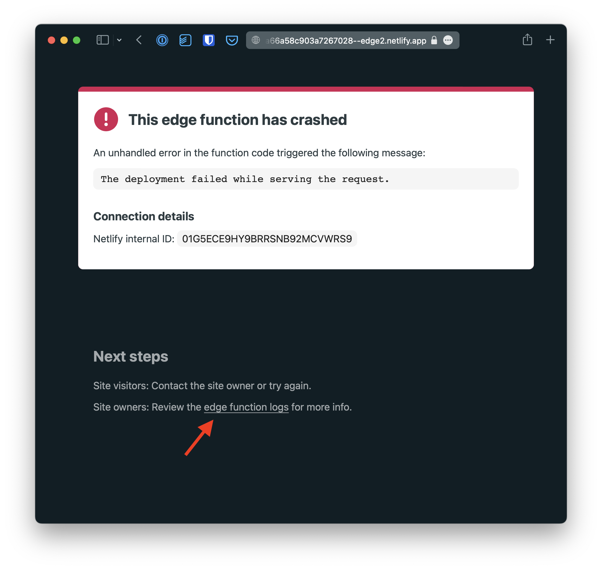

# Read logs for uncaught exceptions

When a Vercel Edge Function throws an uncaught exception,
an error page is served.
To access the full error message, click on the "Edge Function Logs" link:




## Code example

Edge Functions are files held in the `api/` directory.

```ts
export default async () => {
  throw new Error("💥");
};
```

- [Explore the code for this Edge Function](../../pages/error.ts)

## View this example on the web

- /example/uncaught-exceptions

