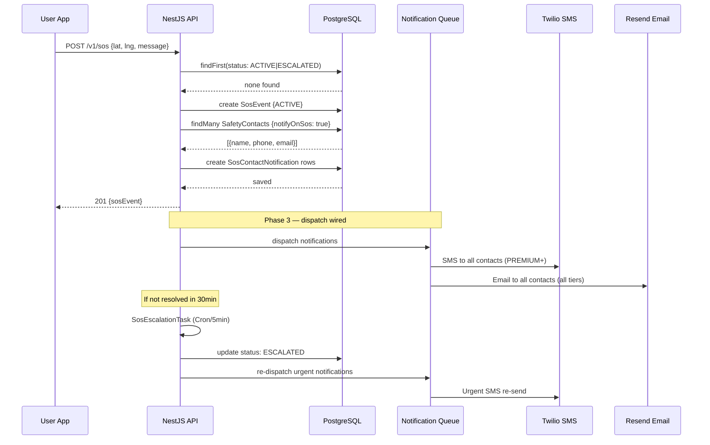
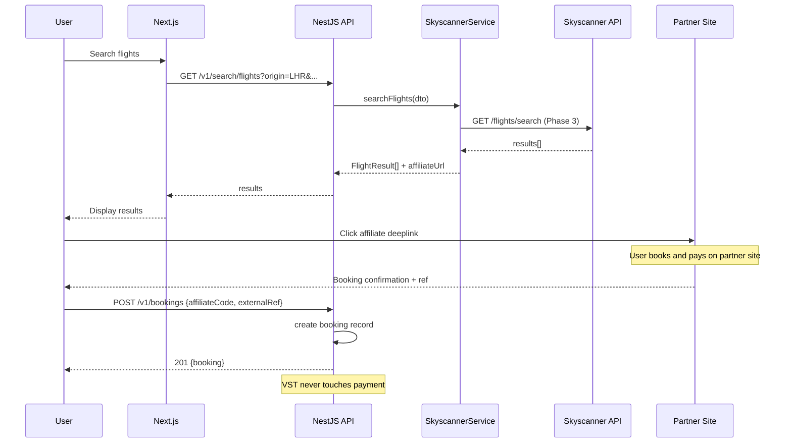
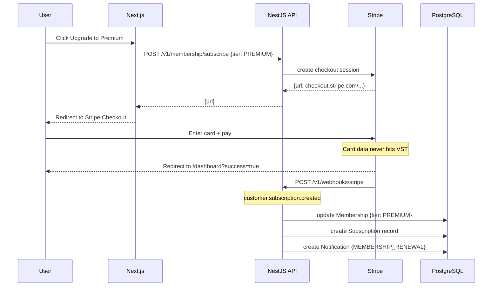

# VST Platform — Mermaid Diagrams

Renders on GitHub. For the full ASCII diagram see `architecture-diagram.md`.

---

## Full System Topology

```mermaid
graph TB
    subgraph CLIENT["CLIENT LAYER"]
        WEB["Next.js Web App<br/>Vercel CDN / Edge<br/>SSG · SSR · RSC"]
        MOB["Mobile App<br/>React Native / Expo<br/>⏸ Future"]
    end

    subgraph IDENTITY["IDENTITY — Clerk (Hosted)"]
        CLERK["JWT Issuance · JWKS · MFA<br/>Social Login · Webhooks"]
    end

    subgraph API["API LAYER — NestJS (Railway :3001)"]
        PIPELINE["ClerkAuthGuard · ThrottlerModule · ValidationPipe"]

        subgraph MODULES_LIVE["Core Modules — Phase 2 ✅"]
            AUTH["Auth Module<br/>Clerk sync · JWT guard<br/>GDPR delete"]
            USERS["Users Module<br/>Profile · Prefs<br/>Contacts · Passport"]
            SAFETY["Safety Module<br/>SOS · Check-ins<br/>Escalation Cron/5min"]
            BOOKING["Booking Module<br/>Flight · Hotel search<br/>Records · Price Alerts"]
        end

        subgraph MODULES_P3["Phase 3 Modules ⏳"]
            NOTIF["Notifications<br/>Email · SMS · Push"]
            MEMBER["Membership<br/>Tier mgmt · Upgrade"]
            PAYMENTS["Payments<br/>Stripe subs · Webhooks"]
            VISA["Visa & Embassy<br/>Passport expiry"]
        end

        subgraph MODULES_DEF["Deferred ⏸"]
            COMMUNITY["Community<br/>Reviews · Media"]
            EXPLORER["Explorer Map<br/>Pins · Geocoding"]
            PARTNERS["Partners<br/>Campaigns · Affiliates"]
        end

        subgraph INTEGRATIONS["Integration Services"]
            SKYSVC["SkyscannerService"]
            BCOMSVC["BookingComService"]
            STRIPESVC["StripeService"]
            TWILSVC["TwilioService"]
            RESENDSVC["ResendService"]
            MAPBOXSVC["MapboxService"]
        end
    end

    subgraph DATA["DATA LAYER"]
        PG["PostgreSQL<br/>Neon / Supabase<br/>18 models · Prisma ORM"]
        REDIS["Redis<br/>Upstash<br/>Cache · Queues"]
        R2["Cloudflare R2<br/>Media Storage"]
    end

    subgraph EXTERNAL["EXTERNAL INTEGRATIONS"]
        SKY["Skyscanner<br/>Flight Search<br/>Affiliate deeplinks"]
        BCOM["Booking.com<br/>Hotel Search<br/>Affiliate deeplinks"]
        STRIPE["Stripe<br/>Subscriptions<br/>PCI DSS compliant"]
        TWILIO["Twilio<br/>SMS — SOS Alerts<br/>Price Alerts"]
        RESEND["Resend<br/>Transactional Email<br/>SOS · Passport · Alerts"]
        MAPBOX["Mapbox<br/>Explorer Map<br/>Geocoding"]
        N8N["n8n Automation<br/>Price alerts · Passport expiry<br/>SOS escalation"]
    end

    WEB -->|"Bearer JWT"| IDENTITY
    MOB -->|"Bearer JWT"| IDENTITY
    CLERK -->|"user.created/updated/deleted"| AUTH

    WEB -->|"HTTPS + JWT"| PIPELINE
    MOB -->|"HTTPS + JWT"| PIPELINE
    PIPELINE --> AUTH
    PIPELINE --> USERS
    PIPELINE --> SAFETY
    PIPELINE --> BOOKING
    PIPELINE --> NOTIF
    PIPELINE --> MEMBER
    PIPELINE --> PAYMENTS
    PIPELINE --> VISA

    BOOKING --> SKYSVC
    BOOKING --> BCOMSVC
    PAYMENTS --> STRIPESVC
    NOTIF --> TWILSVC
    NOTIF --> RESENDSVC
    EXPLORER --> MAPBOXSVC

    SKYSVC -->|"RapidAPI"| SKY
    BCOMSVC -->|"Affiliate API"| BCOM
    STRIPESVC -->|"Stripe SDK"| STRIPE
    TWILSVC -->|"REST API"| TWILIO
    RESENDSVC -->|"REST API"| RESEND
    MAPBOXSVC -->|"REST API"| MAPBOX

    AUTH --> PG
    USERS --> PG
    SAFETY --> PG
    BOOKING --> PG
    NOTIF --> PG
    MEMBER --> PG
    PAYMENTS --> PG
    VISA --> PG

    BOOKING -->|"Search cache"| REDIS
    NOTIF -->|"Job queue"| REDIS

    COMMUNITY -->|"Media refs"| R2
    EXPLORER -->|"Media refs"| R2

    N8N -->|"Webhook triggers"| API

    style MODULES_LIVE fill:#1a3a1a,stroke:#4ade80,color:#e2e8f0
    style MODULES_P3 fill:#1a1a3a,stroke:#818cf8,color:#e2e8f0
    style MODULES_DEF fill:#2a2a2a,stroke:#6b7280,color:#9ca3af
    style CLIENT fill:#0f172a,stroke:#d4a853,color:#e2e8f0
    style IDENTITY fill:#1e1a0a,stroke:#d4a853,color:#e2e8f0
    style API fill:#0f1a2a,stroke:#3b82f6,color:#e2e8f0
    style DATA fill:#0f1a2a,stroke:#06b6d4,color:#e2e8f0
    style EXTERNAL fill:#1a0f2a,stroke:#a855f7,color:#e2e8f0
```

---

## SOS Data Flow

---

## Booking Affiliate Flow

---

## Membership Upgrade Flow

